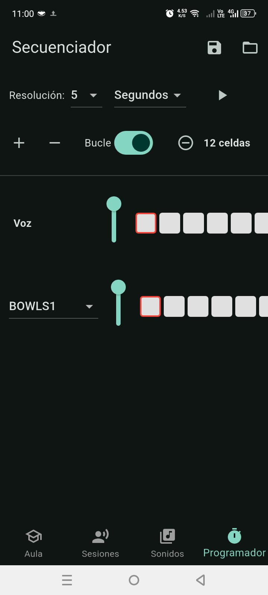

# 🧘 Zen Whisper (Audio Sequencer)

Un secuenciador de ambientes sonoros diseñado para la meditación y la relajación. A diferencia de los reproductores de ruido blanco tradicionales, Zen Whisper permite programar una línea de tiempo visual para crear paisajes sonoros evolutivos.

## 💡 Concepto y Estado

Este proyecto fue concebido como una plataforma integral de bienestar (Audio + Video). Actualmente, el **módulo de audio y secuenciación es totalmente funcional**, permitiendo:

* **Secuenciación Visual:** Interfaz de línea de tiempo para programar cuándo entra y sale cada capa de sonido.
* **Mezcla de Capas:** Combinación de múltiples fuentes (Lluvia, Cuencos Tibetanos, Viento, Grillos) con control de volumen independiente.
* **Gapless Looping:** Motor de audio diseñado para bucles perfectos sin cortes audibles.

*Nota: El desarrollo de los módulos de video guiado se encuentra pausado, pero la herramienta de diseño sonoro es operativa.*

## 📥 Probar el Prototipo

Puedes descargar el APK funcional desde **[Releases](../../releases)**.

---

> **Autor:** Raúl Héctor Cámara Carreón
